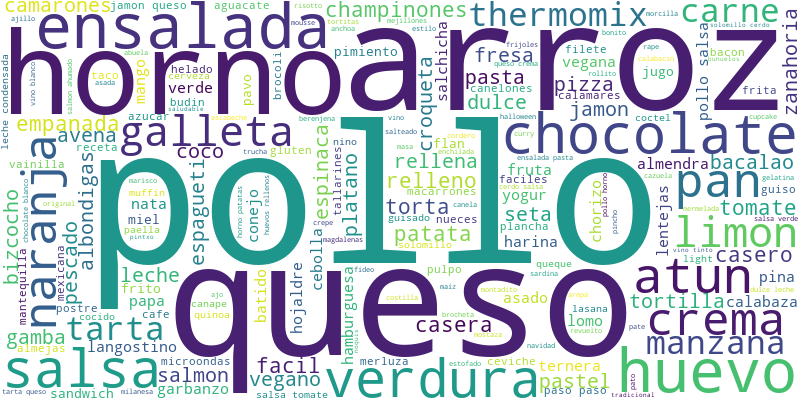
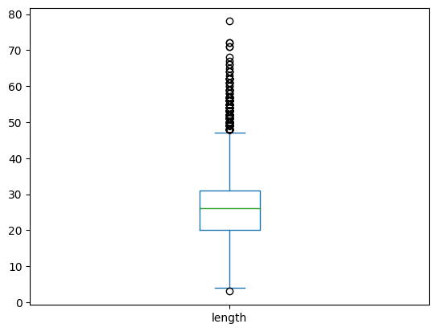
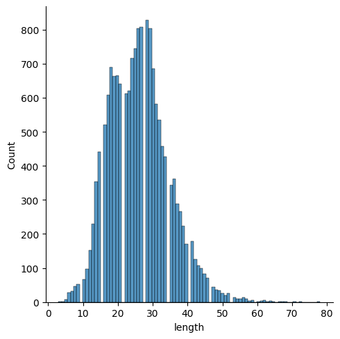
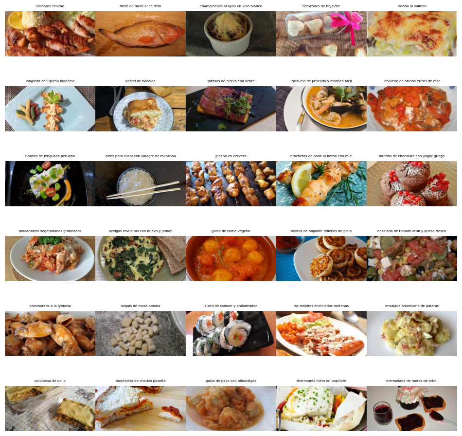

# Platos de comida
## Descripción
El siguiente dataset son imagenes con platos de comidas y su titulo. El dataset se creó haciendo scrapy a la siguiente página web <a href="https://www.recetasgratis.net/">Recetas gratis</a>, la metodología es la siguiente:
1. Se obtiene el link de la página principal de la categoría de comida.
2. Se obtiene el link de la página de cada receta.
3. Se obtiene el link de la imagen de la receta.
4. Se obtiene el titulo de la receta.
## Imagenes
Las imagenes tienen un tamaño de 300x300 pixeles y se encuentran en formato jpg.
## Metadatos
Los metadatos que se encuentran en el dataset son los siguientes:
+ **prompt**: Titulo de la receta.
+ **source**: path de la imagen.
+ **uuid**: Identificador único de la imagen.
  
Nota 1: El dataset se encuentra en formato csv.
Nota 2: El nombre de las imagenes tambien va el titulo

## Directorio
```bash
|-- README.md - Este archivo
|-- dataset.csv - Dataset
|-- images - Imagenes
|-- src - Código fuente, en especial el script de scrapy
```
## Análisis exploratorio de datos

El ánilisis exploratorio se centra en el texto, para las imagenes tocaría aplicar herramientas de visión por computador como clip, para crear ciertas clasificaciones.

### Análisis de texto


En la imagen podemos ver las palabras más frecuentes para el texto, tambien podemos ver un boxplot del texto

Aquí podemos ver como existen palabras muy pequeñas y muy grandes, por lo que recomendamos al usario que se fije en el texto para ver si le sirve el tamaño del texto

En el siguiente histograma podemos ver la distribución de los tamaños de los textos, podemos ver que la mayoría de textos tienen un tamaño menor a 78 caracteres, el 75% del dataset tiene un tamaño de 31 caracteres.

### Análisis de imagenes
Se recomienda analizar por medio de redes neuronales, para sacar más provecho y verificar la correspondecia entre el prompt y la imagen. (Una idea es hacer esto con CLIP)


